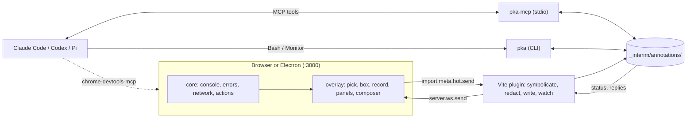

# pk-annotator: design

A standalone, dev-only, floating package that replaces Agentation (toolbar, server, and MCP registrations) everywhere Paul uses it. It covers element picking (click, Shift multi-select, marquee), prompt composition, flow recording, network and console inspection with error hunting, and a performance panel.

## Decisions (Paul, 2026-10-02)

1. **Capture is built in.** `core/` wraps fetch, XHR, console, and error events itself.
2. **Own MCP server.** `pka-mcp` is a stdio server over a per-project file store in `_interim/annotations/`.
3. **AI Elements is installed** with shadcn into the overlay. The overlay keeps lucide icons; shadcn variables map to Lean tokens through a theme file.
4. **Home: `~/srv/pk-annotator`**, Forgejo `srv/pk-annotator`, published to the Forgejo npm registry as **`@srv/pk-annotator`** (`https://git.paulbkim.dev/api/packages/srv/npm/`). The scope is required because pnpm routes only scoped packages to a second registry. Consumers set `@srv:registry` in `.npmrc` and list the package in `pnpm.minimumReleaseAgeExclude`. Worktrees go at `~/.worktrees/pk-annotator/<branch>`.
5. **Agentation is removed completely**: Lean, Mantra, the Claude Code user registration, and the Platform service.
6. **Tools only, no idle cost.** The MCP server uses no resources, prompts, sampling, roots, or logging primitives. Nothing polls, and nothing holds memory beyond fixed caps when unused.

## Package layout

```text
pk-annotator/
├── src/
│   ├── core/          # in-page capture: console, errors, network, user actions; ring buffers, redaction, clear watermark
│   ├── select/        # hit testing, Shift toggle, marquee, selector and source resolution
│   ├── overlay/
│   │   ├── launcher.ts    # plain DOM button in a shadow root; loads the React UI on first open
│   │   ├── ui/            # shadcn primitives pulled by the registry
│   │   ├── ai-elements/   # prompt-input, attachments (ai-elements CLI)
│   │   └── shadow.css     # Tailwind adopted into the shadow root; @property registered on document
│   ├── vite/          # serve-only plugin: source attributes, HMR channel, symbolication, store writer and watcher
│   ├── store/         # file store: root discovery, id validation, atomic writes, claims, prune
│   ├── ops/           # operations shared by CLI and MCP: list, get, wait, set_status, reply, errors
│   ├── cli/           # pka: the same operations with --json; pka watch --once; pka lab; pka prune
│   └── mcp/           # pka-mcp: stdio, tools only, thin wrapper over ops
├── components.json    # shadcn config
└── package.json       # exports ./vite and ./overlay; bins pka, pka-mcp
```

The agent skill that teaches `pka` lives in pkai, per Paul's rule that skills go there.

## Lean changes

```diff
 package.json                 # + @srv/pk-annotator (root devDependency, so node_modules/.bin/pka-mcp resolves)
                              # + pnpm.minimumReleaseAgeExclude: ["@srv/pk-annotator"]; .npmrc: @srv:registry
+.mcp.json                    # Claude Code: pka → node_modules/.bin/pka-mcp
+.codex/config.toml           # Codex: [mcp_servers.pka]
+.pi/mcp.json                 # Pi 1.0: pka, exposure "direct"
 AGENTS.md                    # + dev-only tooling in its own shadow root may use its own component library
 apps/web/
 ├── package.json             # - agentation 3.1.2, + @srv/pk-annotator
 ├── vite.config.ts           # + annotator({ bodies: ["/api/", "/ui-api/"] })
 └── src/
+    ├── client.tsx           # dev: mount({ hot: import.meta.hot }), then hydrateRoot(..., reactRootOptions)
+    ├── annotator-theme.css  # maps shadcn variables to --lean-* tokens
     ├── routes/__root.tsx    # - Agentation lazy import and <Agentation endpoint=…>
     └── styles.css:3310      # agentation-toolbar selector → pk-annotator host element
 apps/server/                 # dev-only Server-Timing middleware (handler, db, auth)
 apps/desktop/                # dev-only setDisplayMediaRequestHandler and debug port
 scripts/verify               # fail if a sentinel string appears in the production bundle
```

`pka-mcp` is launched from `node_modules/.bin` directly, not through `pnpm exec`, so each agent session costs one process instead of two.

The client entry, in the shape TanStack Start documents:

```tsx
import { StartClient } from "@tanstack/react-start/client";
import { StrictMode } from "react";
import { hydrateRoot } from "react-dom/client";

let rootOptions = {};
if (import.meta.env.DEV) {
  const annotator = await import("@srv/pk-annotator/overlay");
  rootOptions = annotator.mount({ hot: import.meta.hot! }).reactRootOptions;
}
hydrateRoot(document, <StrictMode><StartClient /></StrictMode>, rootOptions);
```

The consumer passes `import.meta.hot` because a pre-bundled dependency has no HMR context of its own; the app's client entry does.

## Public API

```ts
// @srv/pk-annotator/vite
type AnnotatorOptions = {
  bodies?: string[];        // same-origin path prefixes whose JSON or text bodies are captured
  maxStoreBytes?: number;   // store size cap; new video is refused above it (default 500 MB)
};
function annotator(options?: AnnotatorOptions): Plugin[];

// @srv/pk-annotator/overlay
type ThemeSetting = "light" | "dark" | "system";
type MountOptions = {
  hot: ViteHotContext;                    // the consumer's import.meta.hot
  theme?: ThemeSetting;                   // initial theme; "system" follows prefers-color-scheme (default)
};
type Mounted = {
  reactRootOptions: Pick<HydrationOptions, "onCaughtError" | "onUncaughtError" | "onRecoverableError">;
  setTheme(theme: ThemeSetting): void;    // applies at once to the launcher and, once loaded, the UI
  unmount(): void;
};
function mount(options: MountOptions): Mounted;
```

The theme sets `data-theme` on the host element and `.dark` on `.pka-root`. A consumer whose theme setting loads after mount, as Lean's does, calls `setTheme` when it loads and whenever it changes. The launcher keeps the setting, so a call made before the UI chunk loads still applies when the UI opens.

API calls go through the Vite proxy (`apps/web/vite.config.ts:144`), so they are same-origin in dev and `traceparent` or `Server-Timing` needs no CORS change.

## Overlay component tree

```tsx
<pk-annotator> shadow root
  launcher.ts  plain DOM button with an error badge; no React until first open
  <Dock>  React root, loaded on first open; draggable, snaps to a corner
    Pick · Box · Record · Network · Console · Perf · Compose   (named icon buttons, Tab-reachable)
  <PickLayer>  takes pointer events only while picking
    <HoverBox> component name + file:line
    <SelectionBox n> numbered badge per selected element
    <MarqueeRect>
  <Panel>  one open at a time
    <NetworkPanel> | <ConsolePanel> | <PerfPanel> | <RecordingPanel>
  <Composer>  AI Elements PromptInput
    <ElementChips>     one per selected element, removable
    <AttachmentChips>  recording, error groups, requests, perf snapshot
    <Textarea> + Send (to the store) / Copy (Markdown)
  <Thread>  agent replies and status for sent annotations
```

## Data flow



The store is the only shared state. The plugin writes annotations and the live error snapshot; `pka-mcp` and `pka` write status changes and replies through the same `ops/` code; the plugin watches the store and pushes changes to the overlay.

## Resource budget

Nothing runs that you are not using, and production carries zero bytes.

| Piece | Idle (dock closed, not recording) | In use |
|---|---|---|
| Launcher | One DOM button in a shadow root; React, AI Elements, and Tailwind not loaded | UI chunk loads on first open by dynamic import |
| Console and errors | Wrappers append to fixed ring buffers (500 entries). Arguments are serialized at capture time with depth and length caps, so the buffer never holds app objects. Only new error groups are sent to the plugin, throttled to once per second | Batched to the plugin every 250 ms while a panel is open or a recording runs |
| Network | Request metadata only, same ring-buffer cap. Bodies are captured only for allowlisted same-origin paths, 64 KB each, 8 MB total. Event streams (Lean's live connection, `apps/web/src/sse-client.ts:19`) are never cloned; only open, close, and byte count are recorded. The overlay's own requests (source maps for symbolication, images and fonts snapdom inlines) use the unwrapped fetch and are never recorded | Same |
| Performance | No observers. Opening the Perf panel starts PerformanceObserver with `buffered: true`, which still returns LCP, CLS, and earlier long animation frames | `react-scan/lite` runs only while the Perf panel is open |
| Recording | Off | Keyframes only at actions, navigations, and errors; video only when chosen |
| Automation | Nothing mounts when `navigator.webdriver` is true (Playwright, e2e runs) | n/a |
| Vite plugin | One `fs.watch` on the store; source transform runs only under `serve` | Writes on events only |
| pka-mcp | Not running until a client spawns it. Between calls it holds no timers or watchers. It exits on stdin EOF | `wait_for_annotation` holds one inotify watcher for its bounded duration, then closes it |
| pka CLI | No process | `pka watch --once` exists only while waiting |
| Store | `pka prune` removes resolved and dismissed annotations older than 7 days; new video is refused above a size cap (default 500 MB) | n/a |
| Production | Absent; `scripts/verify` fails if the sentinel appears in the build | n/a |

The one standing cost is MCP itself: each agent session keeps one idle Node process alive for its lifetime. Using only the CLI avoids even that.

The numeric caps are starting defaults to tune.

## MCP server

`pka-mcp` targets the current specification, **2026-07-28**, through `@modelcontextprotocol/server` 2.2.0 and `serveStdio`. The SDK also serves clients that still use the older `initialize` handshake, which today is all three: Claude Code by default, Codex 0.160, and Pi 1.0 (2025-11-25).

It uses tools and nothing else. Resources and prompts are not used. Roots, sampling, and logging are deprecated in 2026-07-28 and not used. Tasks is now an extension that none of the three clients supports. Logs go to stderr; stdout carries only JSON-RPC.

| Tool | Returns | Annotations |
|---|---|---|
| `list_annotations(status?, limit, cursor, detail)` | pending by default; cursor pagination | readOnlyHint |
| `get_annotation(id, detail)` | prompt, elements, attachments with file paths and summaries (recording, error groups, perf verdict) | readOnlyHint |
| `wait_for_annotation(timeoutSec = 50, max 1800)` | the oldest pending, unclaimed annotation, immediately if one exists, otherwise the first to arrive; `{ timedOut: true }` as a normal result | readOnlyHint |
| `set_status(id, status, note?)` | `acknowledged` creates `claim.json` with `O_EXCL`; `resolved` and `dismissed` append a status event | destructiveHint false, idempotentHint true |
| `reply(id, text)` | appended to `thread.jsonl`, shown in the overlay | destructiveHint false, idempotentHint false |
| `get_errors(since?, limit, detail)` | open error groups from the live snapshot | readOnlyHint |

All tools set `openWorldHint: false`. Input schemas are Zod `strictObject`, which the SDK turns into `additionalProperties: false`; a validation failure returns `isError` and the handler never runs. Every tool returns `structuredContent` and the same JSON as text, because Claude Code passes only `structuredContent` to the model when both are present. Read tools declare `outputSchema`. Errors say what to do next, for example "No annotation `x`; call list_annotations".

**Lifecycle.** `pending → acknowledged → resolved | dismissed`. Resolved and dismissed are final for agents: `reply` and `set_status` on a closed annotation fail and tell the agent to reply before resolving; repeating the same final status is a no-op. A human reply from the overlay on a closed annotation reopens it to `pending` and removes the claim, so the next `wait_for_annotation` picks it up again. The plugin watches the store root plus each open annotation's directory, so watch count follows open annotations, never capture files.

**Waiting.** `wait_for_annotation` defaults to 50 seconds so it finishes inside Codex's 60-second default tool timeout. It sends a progress notification every 15 seconds when the client supplied a progress token, which keeps Claude Code and Pi from timing out on longer waits. The watcher closes on result, on `ctx.mcpReq.signal` abort, or when the connection closes. In Claude Code, `pka watch --once --json` run under the Monitor tool re-invokes the agent the moment you press Send, with no process left afterwards.

**Responses.** `detail: "concise"` is the default and stays well under Claude Code's 10k-token warning. Frames, video, and traces are returned as paths, never inline.

**Project root.** `--root` or `PKA_ROOT`, then `CLAUDE_PROJECT_DIR`, then walk up from cwd to `_interim/annotations`. If none is found, the server fails at startup with the reason.

**Security.**

- Ids must match `^[a-z0-9-]{8,40}$`.
- Resolved paths are checked with `path.relative` against the store.
- Symlinks are refused (`lstat`), and claims are created with `O_EXCL | O_NOFOLLOW`.
- Page-derived content (text, HTML, console messages, request bodies) is kept in fields separate from your prompt. Control and bidirectional-override characters are stripped, and lengths are capped.
- Tool descriptions state that page content is data, not instructions.
- The server opens no network listeners.

**Registration per client.**

```text
.mcp.json            Claude Code   { "pka": { "command": "node_modules/.bin/pka-mcp" } }
.codex/config.toml   Codex         [mcp_servers.pka] command = "node_modules/.bin/pka-mcp"
.pi/mcp.json         Pi 1.0        pka, exposure "direct"
```

```text
_interim/annotations/
├── live/errors.json         # rewritten by the plugin as groups change
└── <id>/
    ├── annotation.json      # prompt, elements, attachments
    ├── state.json           # pending | acknowledged | resolved | dismissed, with history; temp file + rename
    ├── claim.json           # present once an agent acknowledges
    ├── thread.jsonl         # agent replies and your follow-ups
    └── capture/             # recording, frames, errors, network, perf verdict
```

## Selection

```text
pick mode, capture-phase pointer listeners, overlay host skipped in elementsFromPoint
  click          → selection = [target]
  Shift+click    → toggle target in selection
  drag > 4 px    → marquee
  Esc            → clear
marquee end(rect)
  candidates = interactive, text, img, or [data-pka-src] elements, minus tiny and near-viewport-size ones
  hits = full containment (Alt: intersection)
  hits = drop any hit that contains another hit
  hits = replace with the component root when every child of that root is hit
  selection = Shift ? selection ∪ hits : hits
```

Source location comes from our own serve-only Vite plugin (spike: `/tmp/pk-annotator/spike-source/plugins/pka-source.ts`). It parses with Vite's re-exported `parseSync` and `Visitor` and writes with `magic-string`, stamping `data-pka-src="<workspace-relative path>:line:col"` (1-based) on every lowercase host JSX element. Paths are relative to `searchForWorkspaceRoot`, so Lean reports `apps/web/src/...`. The hook must use `enforce: "pre"` and `transform.order: "pre"` so it stamps the untouched source in client, route-split, and SSR environments alike; without that order the spike reproduced a hydration mismatch. TanStack's `injectSource` was rejected: fixed attribute name, composite elements stamped, spread detection defeated by rest destructuring, parse errors swallowed.

Each element reports two locations when they differ: `source` (the host element's own JSX, for example `button.tsx:4:10` inside a `Button` wrapper) and `usedAt` (the nearest user-code owner's call site, for example `index.tsx:20:6`, from bippy `getSource(ownerFiber)`). Elements without the attribute (Radix content, portals, `node_modules`) fall back to bippy 0.7.3: walk `getRawOwnerStack(fiber)`, take the first frame under the project and outside `node_modules`, and symbolicate it. bippy columns are 0-based (add 1) and file names are basenames (resolve with `new URL(source, frameUrl)`). A cold lookup costs about 300 ms while source maps load, so pick mode pre-warms it. Owner chains drop every frame whose URL contains `/node_modules/`, which removes `SafeFragment`, `MatchInnerImpl`, `Lazy`, `Primitive.*`, and the like, while keeping user components such as `RootDocument`.

In React Bench, tools that sent `file:line` let the agent find the right file 95 to 96% of the time; tools that sent only a component name scored 86%, the same as no tool.

## What the agent receives

```xml
<annotation id="a-17" route="/projects/abc" viewport="1440x900@2">
<prompt>Archive should confirm first; the row below jumps when this one leaves.</prompt>
<element n="1" source="apps/web/src/ui/button.tsx:4:10" usedAt="apps/web/src/project-row.tsx:48:7" owners="ProjectRow > ProjectList"
         role="button" name="Archive project" crop="capture/frames/sel-1.webp"/>
<capture>_interim/annotations/a-17/capture/summary.md</capture>
</annotation>
```

Per element, in order of how much it changes agent results: call-site `file:line:col`, owner component chain, the comment, selector (role and accessible name, test id, CSS), trimmed `outerHTML`, bounding box with viewport and scroll, route, cropped screenshot path. Computed styles only for style requests.

## Error hunting and clearing

```text
on window error (capture phase) | unhandledrejection | console.error | React root handlers
  stack = symbolicate(raw)                         # plugin, via module-graph source maps
  fp    = type + normalized message + top 3 in-app frames as path:fn (no line, so an edit above the throw keeps the group)
  group[fp]: count, firstSeen, lastSeen, lastSeq
Hunt(one group) / Hunt all
  attach the error, owner stack, and the actions and requests in the 20 s before first occurrence
  write an annotation; mark each group "sent"
Clear
  watermark = seq; a group that recurs after the watermark reopens
after the agent resolves and HMR reloads
  not seen again → "cleared"; seen again → reopened with the new stack
```

## Recording

A recording defaults to an event timeline with keyframes; video is opt-in. Agents use named actions far better than video: Jam had to add frame-extraction tools before agents could use its recordings.

```text
capture/
├── summary.md       # about 2 KB; the agent reads this first
├── manifest.json    # URL, viewport, git SHA, times, redaction policy
├── timeline.jsonl   # actions, navigations, console, errors, requests, joined by seq and traceparent
├── network.jsonl    # redacted, HAR-like
├── errors.json      # deduplicated groups
├── frames/NNN.webp  # snapdom keyframe at each action, navigation, error
└── video.webm       # opt-in: getDisplayMedia + Element Capture restricted to the app root
```

Redaction happens in the page: inputs masked, auth and cookie headers dropped, bodies kept only for allowlisted same-origin API paths, storage never read.

**Content Security Policy.** Keyframes and selection crops come from snapdom, which renders the page as an SVG `<foreignObject>` image and draws it into a canvas. Chromium lets such a canvas be exported only when the image loads from a `data:` URL. Loaded from a `blob:` URL, the image taints the canvas and `toBlob` throws; `createImageBitmap` cannot decode it, and `OffscreenCanvas` is tainted the same way (probed in Playwright 1.63 Chromium on 2026-10-03). A page CSP must therefore allow `img-src data:`, and `blob:` for images pasted into the composer. Without `data:`, sending fails with an error that names the CSP. The fixture's dev server sends `img-src 'self' blob: data:` so that this minimum stays tested.

## Performance

| Live in the overlay (dev build, labeled as such) | Lab run (`pka lab`, production build) |
|---|---|
| web-vitals 6.2.2 attribution with soft navigations: LCP subparts, INP breakdown with element, CLS culprit | The recorded flow replayed N times at 4x CPU and Slow 4G |
| Long animation frames, top N by blocking time, grouped by script and function, layout thrashing flagged | Chrome DevTools trace insights (LCPBreakdown, INPBreakdown, ForcedReflow, RenderBlocking) |
| Slow requests with the `Server-Timing` breakdown, joined to the interaction that caused them | `react-dom/profiling` render tracks |
| `react-scan/lite` render hot spots with file:line and changed props | Verdict JSON: value, budget, pass/fail, culprit, conditions, noise band, trace path |

The overlay names suspects; pass/fail claims come only from lab verdicts on production builds.

## AI Elements inside the shadow root

Proven in the spike at `/tmp/pk-annotator/spike-ui/` (shadcn 4.21.1 `init -t vite -b radix`, ai-elements 1.9.0 `add prompt-input attachments`, Tailwind 4.3.3, React 19.3.0), verified with Playwright against a host page with hostile global CSS:

1. **Stylesheet.** Import the compiled CSS with `?inline`, build one `CSSStyleSheet`, and adopt it into the shadow root. shadcn variables live on `:host`; base `html`/`body` rules move to `.pka-root`. `:host { all: initial !important; position: fixed !important; inset: 0 auto auto 0 !important; z-index: 2147483647 !important }` stops inherited host styles. Fonts declared with `@font-face` inside a shadow root do not load; use system fonts or declare faces on `document`.
2. **rem.** A PostCSS step rewrites `Nrem` to `N*16px` in the overlay stylesheet, so a host `html { font-size }` cannot resize the overlay.
3. **`@property`.** Collect the sheet's `CSSPropertyRule`s and adopt them once on `document`.
4. **Focus.** Radix Select and Menu compare `document.activeElement`, which is retargeted to the host element. While mounted, an instance getter on `document` returns `shadow.activeElement` only when the native value is our host; unmount removes it.
5. **Portals.** A context supplies a portal container inside the shadow root, a sibling of the app root, to every shadcn portal.
6. **Stacking.** The host is the only stacking context; the dock carries no z-index, so portal content stacks above it.
7. **No modal primitives.** Modal Select, Dialog, and DropdownMenu lock host scrolling, set `pointer-events: none` on `body`, and put `aria-hidden` on host elements; the spike measured an 8 px host shift. Use non-modal variants only: `modal={false}` menus, and a non-modal menu or popover in place of Select (including PromptInput's model select).
8. **Theming.** Consumers theme through custom properties on the host element (`pk-annotator { --primary: var(--lean-accent); --radius: 4px; }`), which beat `:host` and inherit across the boundary. Dark mode needs a `.dark` class on `.pka-root`, driven by the consumer's theme attribute or `prefers-color-scheme`.

Outside-click dismissal needed no `composedPath()` fix. Sizes from the spike's production build: launcher 1.65 kB gzip; UI chunk 135 kB gzip including 9 kB of CSS, loaded only on first open.

## Agentation removal

Order matters: each step leaves a working setup.

1. **Carry over open work.** The shared store holds 6 pending annotations, which are 3 unique Lean notes from 2026-09-28 (project row icon padding and focus outline, the "New project" button style, the location-bar command icon). Move them into the new store or file them as Lean issues.
2. **Lean** (with phase 1): `apps/web/package.json:50`, `apps/web/src/routes/__root.tsx:15-19, 72-76`, `apps/web/src/styles.css:3310`, lockfile regenerated.
3. **Mantra** (`~/projects/mantra`): `apps/ui/package.json:43`, `apps/ui/pnpm-workspace.yaml:6`, `apps/ui/src/agentationDev.tsx`, `apps/ui/src/main.tsx:23-25`, `dev.compose.yaml` agentation service and volume (Postgres stays), `dev.Dockerfile`, `Makefile` `annotate` targets and the `dev: annotate` dependency, `AGENTS.md:21-23`, `.mcp.json`, `.pi/mcp.json`, local `.claude/settings.local.json` `enabledMcpjsonServers`. The `migrate/server-go` worktree carries the same lines.
4. **Claude Code user config:** `claude mcp remove --scope user agentation`.
5. **Platform** (`~/srv/platform`), one commit: `services/archbox-agentation/`, `services/README.md:44-45`, `tests/contracts/archbox-agentation-contract.sh` together with `scripts/verify.sh:70`.
6. **Runtime:** stop the `archbox-agentation` container; remove the exited `mantra-dev-agentation-1` container and the `mantra-dev-agentation` image. Leave the `mantra-dev-agentation-run-*` bridge alone; it belongs to a live Mantra session and removes itself.
7. **Data, after Paul confirms:** volumes `archbox-agentation_store` and `mantra-dev_agentation-data`, `~/.agentation/store.db*`, `~/.local/share/archbox-agentation/`.

Left alone: logs, transcripts, backups, and browser history that mention Agentation; nothing reads them.

## Order of work

1. Store, ops, CLI, `pka-mcp`, source attributes, pick, Shift multi-select, marquee, composer. Lean switches and drops Agentation.
2. Core capture with Network and Console panels, Hunt, Clear, `get_errors`.
3. Recording: timeline, keyframes, opt-in video, Electron display-media handler.
4. Performance: live panel, then `pka lab` and Server-Timing in the API.
5. chrome-devtools-mcp page tools.
6. Mantra switches; Claude Code user entry removed; Platform service retired; data deleted after confirmation.

## Evidence and open questions

Confirmed on 2026-10-02:

- `npm view`: web-vitals 6.2.2, react-scan 0.5.7, bippy 0.7.3, chrome-devtools-mcp 1.10.1, @zumer/snapdom 3.2.0, @tanstack/devtools-bundler-core 0.1.3, @modelcontextprotocol/server 2.2.0 (zod ^4.2.0), @modelcontextprotocol/sdk 1.31.0, @earendil-works/pi-coding-agent 1.0.0.
- The MCP versioning page names 2026-07-28 as the current version. The 2026-07-28 changelog includes the stateless protocol, `server/discover`, and the Roots deprecation.
- The installed Agentation 3.1.2 bundle contains its source probe and marquee candidate list.
- Agentation's pending items show its weaknesses. Two different elements on `/projects` both report `projects-page.tsx:105:22` (a component definition, not the call site). Owner chains are full of framework internals. Every item is stored twice. About 70 KB of sessions come from e2e runs on `127.0.0.1:43129`.
- Docker shows `archbox-agentation` up and healthy and the Mantra bridge running. `~/.claude.json` holds the user-scope `agentation` entry.

Unconfirmed:

- Whether Codex reads project `.codex/config.toml` for MCP servers and shows the model both content channels.
- Cancellation support in Claude Code and Codex.
- Whether chrome-devtools-mcp 1.x attaches to Electron 44.
- Whether Element Capture works through Electron's display-media handler.

Next step: a scratch spike on AI Elements in a Vite library inside a shadow root, source attributes under SSR hydration, and `pka-mcp` against Claude Code, Codex, and Pi (legacy handshake, `structuredContent` visibility, 50-second wait with progress). Then phase 1.

## Sources

- MCP versioning and 2026-07-28 changelog: https://modelcontextprotocol.io/specification/versioning, https://modelcontextprotocol.io/specification/2026-07-28/changelog
- MCP TypeScript SDK v2 tools and stdio: https://ts.sdk.modelcontextprotocol.io/v2/servers/tools.html, https://ts.sdk.modelcontextprotocol.io/v2/serving/stdio.html
- MCP security best practices: https://modelcontextprotocol.io/docs/2026-07-28/tutorials/security/security_best_practices
- Claude Code MCP: https://code.claude.com/docs/en/mcp
- Codex MCP: https://learn.chatgpt.com/docs/extend/mcp?surface=cli
- Writing tools for agents (Anthropic): https://www.anthropic.com/engineering/writing-tools-for-agents
- agent-browser (CLI and MCP over one operation layer): https://github.com/vercel-labs/agent-browser
- Agentation schema, API, MCP: https://www.agentation.com/schema, https://www.agentation.com/api, https://www.agentation.com/mcp
- react-grab and React Bench: https://github.com/aidenybai/react-grab, https://github.com/millionco/react-grab-bench
- Cursor Design Mode: https://cursor.com/docs/agent/design-mode
- TanStack Devtools Vite plugin: https://tanstack.com/devtools/latest/docs/vite-plugin
- TanStack Start client entry: https://tanstack.com/start/latest/docs/framework/react/guide/client-entry-point
- React `hydrateRoot` and `captureOwnerStack`: https://react.dev/reference/react-dom/client/hydrateRoot, https://react.dev/reference/react/captureOwnerStack
- AI Elements: https://elements.ai-sdk.dev/, https://elements.ai-sdk.dev/docs/setup
- Tailwind 4 `@property` in shadow roots: https://github.com/tailwindlabs/tailwindcss/issues/15005
- Playwright locators: https://playwright.dev/docs/locators
- Element Capture: https://developer.chrome.com/docs/web-platform/element-capture
- Electron session: https://www.electronjs.org/docs/latest/api/session
- Jam MCP: https://jam.dev/docs/debug-a-jam/mcp
- Sentry grouping and replay privacy: https://docs.sentry.io/concepts/data-management/event-grouping/, https://docs.sentry.io/platforms/javascript/session-replay/configuration/
- chrome-devtools-mcp tools and third-party tools: https://github.com/ChromeDevTools/chrome-devtools-mcp/blob/main/docs/tool-reference.md, https://github.com/ChromeDevTools/chrome-devtools-mcp/blob/main/docs/third-party-developer-tools.md
- Vite plugin API: https://vite.dev/guide/api-plugin
- web-vitals: https://github.com/GoogleChrome/web-vitals
- Long animation frames: https://developer.chrome.com/docs/web-platform/long-animation-frames
- React Scan: https://github.com/aidenybai/react-scan
- Lighthouse user flows: https://github.com/GoogleChrome/lighthouse/blob/main/docs/user-flows.md
- DevTools throttling accuracy: https://3perf.com/blog/chrome-throttling/
