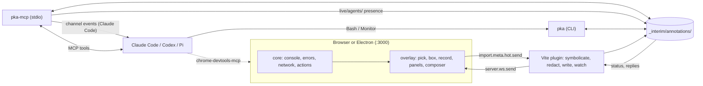

# pk-annotator: design

A standalone, dev-only, floating package that replaces Agentation (toolbar, server, and MCP registrations) everywhere Paul uses it. It covers element picking (click, Shift multi-select, box, lasso), prompt composition, flow recording, network and console inspection with error hunting, and a performance panel.

This document owns the current package contract. Start with [DEVELOPING.md](DEVELOPING.md) for task entry points, tests, and the fixture. Dated consumer migration plans and external runtime observations are in [INTEGRATION-HISTORY.md](INTEGRATION-HISTORY.md).

## Decisions (Paul, 2026-10-02)

1. **Capture is built in.** `core/` wraps fetch, XHR, console, and error events itself.
2. **Own MCP server.** `pka-mcp` is a stdio server over a per-project file store in `_interim/annotations/`.
3. **Tiptap edits prompts as blocks.** Elements, captures, and saved marks are badges in the prompt text; shadcn supplies the remaining controls. The overlay keeps lucide icons; consumers map shadcn variables to their own tokens through a theme file.
4. **Home: `~/srv/pk-annotator`**, private Forgejo repository `srv/pk-annotator`, published from it to the public npm registry as **`pk-annotator`** under the MIT license, with homepage `https://pk-annotator.paulbkim.dev` (Paul, 2026-10-03). Releases through 0.5.0 were `@srv/pk-annotator` on the Forgejo npm registry. Worktrees go at `~/.worktrees/pk-annotator/<branch>`.
5. **Replacement scope:** Lean, Mantra, the Claude Code user registration, and the Platform service. The historical migration plan is in [INTEGRATION-HISTORY.md](INTEGRATION-HISTORY.md#agentation-removal); current migration status belongs to each owning repository.
6. **Tools only, no idle cost.** The MCP server uses no resources, prompts, sampling, roots, or logging primitives. Nothing polls, and nothing holds memory beyond fixed caps when unused. The one exception is Claude Code's experimental `claude/channel` capability, which pushes each sent annotation into an open Claude Code session (Paul, 2026-10-04; see [Channel](#channel)).

## Package layout

```text
pk-annotator/
├── src/
│   ├── shared/        # strict schemas for channel messages, stored data, recordings, verdicts
│   ├── lab/           # production flow replay, trace insights, budget verdicts
│   ├── core/          # in-page capture: console, errors, network, user actions; ring buffers, redaction, clear watermark
│   ├── select/        # hit testing, Shift toggle, marquee, selector and source resolution
│   ├── overlay/
│   │   ├── panels/        # Network, Console, Record, Perf; panel registration
│   │   ├── recording/     # recording lifecycle, keyframes, capture files
│   │   ├── perf/          # live observers, attribution, snapshots
│   │   ├── launcher.ts    # plain DOM button in a shadow root; loads the React UI on first open
│   │   ├── ui/            # shadcn primitives pulled by the registry
│   │   ├── ai-elements/   # prompt-input (ai-elements CLI)
│   │   └── shadow.css     # Tailwind adopted into the shadow root; @property registered on document
│   ├── vite/          # serve-only plugin: source attributes, HMR channel, symbolication, store writer and watcher
│   ├── store/         # file store: root discovery, id validation, atomic writes, claims, prune
│   ├── ops/           # operations shared by CLI and MCP: list, get, wait, set_status, reply, errors
│   ├── cli/           # pka: the same operations with --json; pka watch --once; pka lab; pka prune
│   └── mcp/           # pka-mcp: stdio, tools and the Claude Code channel, thin wrapper over ops
├── fixtures/
│   ├── app/           # TanStack SSR fixture: picker examples, /lab, API routes
│   └── smoke.ts       # browser → annotation store → CLI integration check
├── tools/oxlint/      # vendored anti-slop rules
├── tsdown.config.ts   # entry points, shadow CSS compilation, fetch/observer injection, staged dist/ swap
├── components.json    # shadcn config
└── package.json       # exports ./vite and ./overlay; bins pka, pka-mcp
```

Tests sit beside the code they exercise as `*.test.ts`. [DEVELOPING.md](DEVELOPING.md#task-map) links each task to its implementation, schema, and check. The agent skill that teaches `pka`, `browser-annotations`, lives in pkcc, per Paul's rule that skills go there.

## Public API

```ts
// pk-annotator/vite
type AnnotatorOptions = {
  bodies?: string[];        // same-origin path prefixes whose JSON or text bodies are captured
  maxStoreBytes?: number;   // store size cap; new video is refused above it (default 500 MB)
  storeRoot?: string;       // directory that holds _interim/annotations, relative to Vite's root or absolute (default: Vite's workspace root)
};
function annotator(options?: AnnotatorOptions): Plugin[];   // [] under Vitest

// pk-annotator/overlay
type ThemeSetting = "light" | "dark" | "system";
type MountOptions = {
  hot: ViteHotContext;                    // the consumer's import.meta.hot
  theme?: ThemeSetting;                   // initial theme; "system" follows prefers-color-scheme (default)
};
type Mounted = {
  reactRootOptions: Pick<HydrationOptions, "onCaughtError" | "onUncaughtError" | "onRecoverableError">;
  setTheme(theme: ThemeSetting): void;    // applies at once to the launcher and, once loaded, the UI
  unmount(): void;
};
function mount(options: MountOptions): Mounted;
```

The theme sets `data-theme` on the host element and `.dark` on `.pka-root`. A consumer whose theme setting loads after mount calls `setTheme` when it loads and whenever it changes. The launcher keeps the setting, so a call made before the UI chunk loads still applies when the UI opens.

The consumer passes `import.meta.hot` because a pre-bundled dependency has no HMR context of its own; the app's client entry does. The client entry catches a failed overlay import or `mount()`, reports it with `console.error`, and hydrates without the overlay, because a dev server can reload the page while the package is reinstalled or rebuilt. The build never exposes a partial `dist/`: every tsdown config writes to `node_modules/.cache/pk-annotator-dist/`, and when all have finished each file is renamed into `dist/`, chunks before entries, after which files the build did not produce are removed. Consumer-specific proxy setup is recorded in [INTEGRATION-HISTORY.md](INTEGRATION-HISTORY.md#lean-changes).

## Overlay component tree

```tsx
<pk-annotator> shadow root, a child of <html>
  launcher.ts  the hub: plain DOM button with an error badge; draggable, snaps to a corner; no React until first open
  <PickLayer>  takes pointer events only while picking
    <HoverBox> component name + file:line
    <SelectionBox n> numbered tab outside the element's box, so it never covers the element; only on the route it was picked on
    <MarqueeRect> | <LassoPolygon>
  <MarkLayer>  screenshot area and crop, recording area, rectangle, circle, freehand; drawings kept on the page
  <Panel>  one open at a time, beside the hub
    <RecordPanel> | <NetworkPanel> | <ConsolePanel> | <PerfPanel>
    <Composer>  lazily loaded Tiptap block editor
      <PromptEditor> + Dictate / Copy (Markdown) / Save / Send
        badges in the text: each picked element (details open beside the panel) and capture
    <Composer batch> Send: global comment with a badge per saved mark, Send
    <Thread>  History: agent replies and status for annotations sent from this tab
  <RadialMenu>  React, loaded on first open; rings of named menu items around the hub
    Pick ▸ · Capture ▸ · Annotate ▸ · Debug ▸ · Send · Settings ▸ · Connect agent (no agent)
```

The hub sits 20 px from its corner. Clicking it opens the radial menu; the hub's glyph, three moons on a quarter orbit, previews the quadrant the menu opens into. The first ring sweeps counterclockwise through the quadrant that faces the page, with angles measured counterclockwise from the positive x axis: 0° to 90° from bottom-left, 90° to 180° from bottom-right, 180° to 270° from top-right, and 270° to 360° from top-left. A stem grows out of the hub along the first angle, then a band draws along the ring and its items land on it in sweep order. Hovering a group, or choosing Debug or Settings, grows a short stem out of the group and sweeps its items out the same way on a second, concentric ring, from the group counterclockwise, or clockwise where the quadrant ends first, so the ring grows out of its group; a ring too long for either side is pulled back inside the quadrant. An SVG filter blurs the hub's disk, stems, and bands into one shape, so the joins round off and one edge and shadow surround the whole menu. Its 8 px blur feeds separate alpha thresholds for the fill and edge inside a fixed 328 × 328 CSS-pixel region; sharing the blur avoids a morphology pass for the outline. The shape is hidden, and the filter idle, while the menu is closed. The first ring and its items settle within 200 ms, a group ring within 160 ms, and retraction within 150 ms. Items retain their spring easing and sweep order, animating only transform and opacity; hover and focus colors change immediately. Leaving one group for another waits 140 ms, so a pointer crossing a neighbor on its way outward keeps the open group. Pick, Capture, and Annotate are tool groups: each has no icon of its own and shows the icon and accessible name of its remembered tool, and choosing the group runs that tool. Choosing a tool from a group's ring runs it and makes it the remembered tool. Remembered tools are stored per group in `sessionStorage` (`pka:tool:<group>`), so they last for the tab session; the defaults are Select, Screenshot, and Freehand. Choosing an item closes the menu, which retracts in reverse; Language switches in place and keeps it open. A click outside the menu only closes it, and so does the pointer leaving the browser window; that `mouseout` listener exists only while the menu is open. While no agent is connected, as the latest `pka:agent` message reports, a blue Connect agent item rests in the middle of the hollow between the hub and the first ring, 45° past the stem at the readout's 78 px radius. While another item's readout shows, it moves to 21° past the stem at a 99 px radius, clear of the readout and the band, and it returns 140 ms after the readout clears, so crossing between items does not move it. Hovering or focusing it widens it in place, wherever it is, into a pill of the same height that carries its label, and it does not move while that label shows. It is the first ring's last item for the keyboard. Choosing it sends `pka:setup` and copies a prompt built from the plugin's `pka:setup-info` reply, with the same `ClipboardItem` promise as Send so the write keeps the click's user activation. The prompt names the page's URL and the store's absolute path, gives the `claude mcp add` and `codex mcp add` commands that install `pka` with `--root` set to that store's project root, and tells the agent to install it when its session lacks the pka tools, to ask for a reconnect, and then to call `wait_for_annotation`. The launch command is the workspace's `node_modules/.bin/pka-mcp`, which survives version bumps, else `node` with the `pka-mcp.mjs` beside the running plugin, as in this repository; when neither exists, the prompt first tells the agent to add `pk-annotator` as a dev dependency. No reply within 5 s fails the copy; the menu stays open, and the item and its label show the copy or its failure. It retracts when an agent connects. While the menu is open, the open panel is hidden rather than closed: its draft and state stay, and it shows again when the menu closes unless the chosen item opens another panel or starts a tool that closes it. The hub shows the pick accent while picking or drawing and a pulsing core while recording. Hovering the hub turns the glyph's orbit 16° counterclockwise, and an agent logo has its own hover motion (see [Agent theme](#agent-theme)); under `prefers-reduced-motion: reduce` hover moves nothing.

The menu follows the ARIA menu pattern. Enter or Space on the hub opens it with focus on the first item; Up and Down move within a ring, Home and End jump to its ends, Right opens a group's ring and Left or Escape returns to the group, Enter or Space on a tool group runs its remembered tool and on Debug or Settings opens the ring, and Escape on the first ring closes the menu and returns focus to the hub. Tab leaves the menu and closes it. Toggles such as pick modes, drawing tools, and panels are checkbox items. The closed menu and each unopened group's menu are `aria-hidden`, so a screen reader reaches only the rings on screen and counts only their items. Arrow keys on the focused hub move it to another corner. Escape and Enter inside any menu, including a panel's, never reach picking.

Panels enter with a 150 ms transform and opacity animation. Panels and the menu readout contain their layout and styles; the readout enters in 100 ms. Menu, readout, and panel motion is disabled under `prefers-reduced-motion: reduce`. Picking, a screenshot, or a recording opens the prompt editor immediately. Enter creates a block; Ctrl/Cmd+Enter sends. The editor has no formatting toolbar; Markdown input rules and keyboard shortcuts create headings, lists, quotes, code blocks, and inline formatting. Nothing is listed above the editor: each picked element and each capture (drawing, screenshot, recording, pasted image, error groups, requests, perf snapshot) is an inline badge in the text, so the prompt can point at it. An element badge shows the element's pick number and name, with its source and owners in a card beside the panel; a capture badge shows its kind icon and label. A new badge goes to the cursor while the editor has focus, else to the end. Badges can be dragged between words and blocks, × removes the element or capture, and text editing never deletes a badge. Removing the element or capture elsewhere removes its badge, and an element or capture without a badge gets one at the end. A mark can be sent immediately or saved in this tab; Save stacks it for the Send panel. Send and Copy as Markdown end the current mark once they succeed: its prompt, elements, and captures are cleared, picking stops, and the panel closes. When either fails, the mark stays as it was and the editor shows the error. A Send from the Send panel likewise clears the saved marks and the global comment and closes the panel. Saved marks retain their prompts with badges, elements, and capture snapshots until they are sent; reload or Exit discards unsent marks. The Send panel holds the optional global comment, in which each saved mark is an inline badge (#1, #2, …, numbered in save order); clicking it edits its mark and × deletes the mark. Send creates one annotation from the global text with each mark badge replaced by its mark's numbered section and one deduplicated element list. Capture paths are unique per attachment, so multiple recordings cannot overwrite each other.

Save copies the requests a Network attachment chose and the error groups a Hunt attachment chose into the saved mark.
The copies outlast the capture's ring buffers and live error groups, which can evict the originals before Send.
Adding requests or errors while editing a saved mark merges with that mark's own copies; only the new choices are read from the capture at Send.
Deleting the mark being edited from the Send panel keeps its draft open as a new unsaved mark, which Save stacks again.

In the stored Markdown a badge is `[[mark:<id>]]`, `[[element:<key>]]`, or `[[attachment:<id>]]`. Tiptap's Markdown serializer backslash-escapes `[` and `]` in typed text, so typed text never becomes a badge and text such as `{{mark:abc}}` is sent as typed. On Send, an element badge becomes `[element n]`, where n is the element's `n` in the sent element list, and a capture badge becomes `[attachment n: label]`, where the capture's files are under `capture/attachments/<n>/`. In a batch Send, element numbers follow the combined deduplicated element list and capture numbers run across the marks in order, so the references inside each mark's section resolve against the one annotation. A reference touching a word gets a space so it stays apart from it.
Error attachments use fixed count labels (`1 error` or `N errors`); page error messages stay in the attachment evidence and never enter the prompt through a badge.

Text pasted or dropped from outside the prompt arrives as plain text, a copy or cut inside the prompt pastes back with its badges and formatting, and a pasted image becomes a capture. ProseMirror would parse pasted HTML with `innerHTML` through a Trusted Types policy of its own, which a page that enforces Trusted Types refuses.

While no agent is connected, as the latest `pka:agent` message reports, Send also copies the annotation to the clipboard: the Copy as Markdown text with references resolved, followed by `Annotation files: <dir>`. `<dir>` is the stored annotation's directory from `pka:created`, relative to the workspace root when the store is inside it. Safari and Firefox accept a clipboard write only during the user activation of the click or key press, so Send calls `navigator.clipboard.write` before its first await with a `ClipboardItem` whose text is a promise that resolves when `pka:created` arrives. A browser without `ClipboardItem` gets `writeText` after the send. A pop-up then opens where panels open beside the hub, titled "Copied to clipboard" with the one line "Connect an agent over MCP for live replies" and OK; OK or Escape closes it, and "Don't show again" hides it for the tab session in `sessionStorage`. When the write fails, the pop-up is titled "Couldn't copy to clipboard" and always shows. While an agent is connected, Send does not copy.

Screenshot starts an area gesture: a drag selects an area, and a click without a drag or Enter takes the whole viewport. The capture then opens a crop dialog with the full viewport image and a crop box at the chosen area, with handles on its corners and edges; Enter or ✓ keeps the box, an unchanged full box is a full screenshot, and Escape discards the capture. Record's panel starts a recording of the full viewport, or of an area dragged the same way (a click or Enter records the full viewport). Rectangle, Circle, and Freehand drawings stay on the page in document coordinates, so they scroll with the content and show only on the route they were drawn on, until their mark is deleted or sent. Finishing a drawing saves a mark without opening any panel: its one attachment is a viewport screenshot with the stroke flattened in, its prompt is that attachment's badge, and it joins the Send stack under the same 50-mark and 256 MB limits as Save, so the hub count rises. snapdom's `toCanvas` leaves `scale(devicePixelRatio)` on the canvas context, so the flattening sets its transform absolutely; a relative `scale()` placed the stroke at devicePixelRatio² times its points. The image scale is the canvas width over the root's `clientWidth`, which is the width snapdom clips to.

Every pick and every saved mark records the page it was made on: its URL, and its route, the `location.pathname` that drawings use as their page identity. A mark keeps the page of its first Save when it is edited elsewhere, and keeps a copy of each pick's page, so picking a shared layout's element again on another route does not move an earlier mark. A picked element's numbered box, in the current selection or a saved mark, shows only on the route it was picked on and keeps its number on every route. On another route the box is neither drawn nor matched against that page's elements, even when the element is still connected, as a shared layout's elements are. Back on its route, the box follows the picked element, or, when the route rendered its content again, the element that the CSS selector recorded at the pick now finds. The boxes redraw when the capture reports a navigation, and a pick whose element has not rendered yet waits for it as the resource budget describes. Send describes, locates, and crops an element on its route; an element from another route is sent with the description taken at its pick and without a crop. The Send panel keeps the marks of every route and shows the route on the badge of each mark from another route. This follows the saved-mark model above: the hub counts every saved mark, Send sends all of them as one annotation, and a drawing's mark joins the Send stack while its drawing shows only on its own route. Hiding other routes' marks would make Send's result depend on the route it runs on.

The Dictate button in both editors uses the Web Speech API (`SpeechRecognition` or `webkitSpeechRecognition`) in the overlay language (en-US or ko-KR). Interim results show at the cursor as a decoration that is not part of the document, and each final result is inserted at the cursor. The button is absent when the browser has neither constructor. Chromium sends the audio to a speech service, so dictation needs the network and the browser's speech backend.

Pick groups Select, Box, and Lasso. Capture groups Screenshot, which starts the screenshot gesture, and Record, which opens the record panel. Annotate groups Freehand, Rectangle, and Circle. Debug groups Console, Network, and Performance. Settings groups Update while one is offered (see [Updates](#updates)), History, English/Korean language, and Exit. The first three times Select is activated in a tab session, counted in `sessionStorage`, a tip reading "⇧ Multi-select" follows the cursor from its first move, fades out with a CSS animation after 2.5 s, and unmounts. A group is marked while one of its tools or panels is active, and so are the active item and Send while its panel is open. The mark is the `--pka-pick` color and tint, never `--accent` alone, because a consumer's selected surface can sit within 1.2:1 of the menu. Hover and an open group get a soft fill, 9% of `--popover-foreground`, and the icon at full strength. For the same reason as the mark, keyboard focus adds a 1.5 px ring mixed 55% from `--popover-foreground` into the menu surface, which keeps at least 3:1 against it. The hint beside the hub stays on one line. Exit unmounts the overlay and stops capture. Exit lasts for the tab session: it sets `pka:exited` in sessionStorage, and while that is set, `mount()` starts neither capture nor the hub, only one keydown listener; Alt+Shift+A clears it and mounts. The React root options that `mount()` returns forward to whichever capture is running, and while exited they only log, as React would. Language is stored on the origin; captured content and prompts retain their original language.

While saved marks are unsent, the hub shows their count in place of its glyph or agent logo, inside a ring of twelve dashes in the pick color, as a dashed outline marks a draft. The ring is static and keeps 3:1 against the hub's surface; the count keeps 4.5:1. The working state moves the glyph or logo, which the count hides, and under reduced motion draws a solid ring outside the hub's edge. The ring turns into place once as the first mark is saved and, on hover, turns one dash counterclockwise. Each further save drops the new number into place and ticks the ring back one dash, once. The hub's accessible name adds "n marks waiting to send"; it avoids "pending", which names a sent annotation's status. The mascot does not change. The UI reports the count through `UiContext.setMarkCount`.

### Agent theme

When a `pka-mcp` session is connected to the store, the overlay takes on that agent's look. Claude Code (`claude-code`) gets Anthropic's brand; Codex (`codex-mcp-client`, or any name starting with `codex`) gets OpenAI's. Any other client is named in the hub's accessible label but changes nothing else. The tokens are `!important` declarations on `:host([data-agent])` inside the shadow root, which outrank a consumer's tokens on the host element, so the agent palette replaces the consumer's while the agent is connected and the consumer's returns when it leaves.

| | Claude | Codex |
|---|---|---|
| Palette | Anthropic brand colors (anthropics/skills `brand-guidelines`): Light `#faf9f5` surfaces and Dark `#141413` text in light, the reverse in dark; Light Gray `#e8e6dc` borders and hover; Orange `#d97757` for the logo, Clawd, and dark marks; Blue `#6a9bcc` for focus; Orange, Blue, Green `#788c5d`, and Mid Gray `#b0aea5` (their darker forms in light) for the History status dots | chatgpt.com's neutrals (`#0d0d0d`, `#5d5d5d`, `#f3f3f3`, `#212121`) and its blue `#3566f0` for marks and focus |
| Type | Poppins for labels, titles, buttons, and hints; Lora for the prompt editor and History text (both OFL, fontsource Latin subsets: Poppins 400, 500, 600 and variable Lora) | The system stack chatgpt.com falls back to, then Inter if installed; OpenAI Sans is proprietary |
| Icons | Phosphor regular, which claude.ai ships, for the menu, panel headers, editor actions, and capture badges; other lucide icons drawn at Phosphor's 1.5-unit stroke | lucide at a 1.6-unit stroke, the 1.33 px on 20 px of OpenAI's in-house icons, which are not published |

Every token pair keeps 4.5:1 for text and 3:1 for the pick color, focus ring, and status dots against the overlay surface. Orange and Blue fall below 3:1 on Light, so light Claude marks use a darker clay of the same hue (`#bf502b`, which also carries white text at 4.78:1) and focus uses a darker blue (`#3e7ab6`); secondary text uses a darker Mid Gray (`#5e5d59`), and the dismissed dot `#87867f`. The dark pick colors, like the default dark pick, fall below 3:1 on a white page.

The hub shows the agent's logo as inline SVG with path data verbatim from simple-icons: Claude's mark (16.33.0) and, for Codex, the OpenAI mark (15.14.0, the last release that ships it), because no vector Codex mark is published. The agent's mascot stands beside the hub on the side facing the page: Clawd, drawn pixel for pixel from Claude Code 2.1.288's block-character banner with its arms-down and arms-up poses, or a small terminal with a prompt for Codex. Agent replies in History carry the same mascot and name, taken from the claimant `<client name>:<pid>` in the annotation's acknowledged status event.

All motion is CSS, and nothing animates while idle. Connecting, the agent's color spreads from the hub to the farthest viewport corner while the overlay's colors cross-fade under it; the glyph's moons spiral into the core, the core dissolves at the center, and the mark arrives out of that point as a whole: Claude's blooms with a spring and a quarter turn, the OpenAI mark spins in. The mascot hops in. Disconnecting draws the color back into the hub and reverses the morph. A page that loads with an agent already connected applies the theme without the entrance. While an annotation from this tab is acknowledged and not yet closed, the hub works: Claude's mark turns and pulses between small and full size, as Claude Code's ✻ spinner grows and shrinks, and Clawd steps from foot to foot; the OpenAI mark breathes as it turns slowly, and the terminal's cursor blinks. Without an agent theme the glyph's moons circle the core. When an agent replies, resolves, or dismisses, the hub swells once and a ring leaves it, the mark spins once and settles, and the mascot hops twice: Clawd raises its arms, the terminal nods. Hovering the hub turns the mark: Claude's rays turn 30° and swell to 108% on a spring, and the OpenAI mark turns 60°, one of its six links, so it settles on itself. Under `prefers-reduced-motion: reduce` none of this moves; a static ring marks the working hub. In an agent theme, keyboard focus in the menu uses the theme's `--ring`, which the theme keeps at 3:1.

The theme's stylesheet, schema, fonts, and icons load as a separate chunk with the first `pka:agent` message, so a page whose store has no connected agent loads none of them. The fonts are inlined as bytes (about 82 KB of the chunk's 108 KB) so a consumer's bundler needs no asset handling; a `FontFace` built from bytes fetches nothing, so a page's `font-src` does not apply. They are added to `document.fonts` under the overlay's own family names, `pka Poppins` and `pka Lora`, when the Claude theme first applies, so they never match a consumer's `font-family`; their Latin `unicode-range` sends Korean and other scripts to system fonts. The Phosphor icons reach the UI chunk through `agentIcons` in `registry.ts`; without them the UI draws lucide.

### Updates

The plugin offers a newer npm release in the overlay, and one click installs it. When a page sends `pka:presence`, the plugin reads `https://registry.npmjs.org/pk-annotator/latest` with a 10 s timeout, at most once an hour per dev server; a failed read logs one warning and offers nothing until the next read is due. The plugin replies with `pka:update` only when that release is newer by semantic version than the running one, so a current page loads nothing for updates.

The plugin offers updates only when pk-annotator is installed from the registry: its own manifest must sit under `node_modules`, and the nearest `package.json` from Vite's root up to the workspace root that declares it must give an exact, `^`, or `~` version. Workspace, link, file, catalog, and Git specs get no offer, which covers this repository's fixture. The package manager comes from the workspace root's `packageManager` field, else from its lockfile: pnpm, Bun, Yarn, or npm.

While an update is offered, a 10 px blue dot sits on the hub's bottom-right edge, the same dot marks Settings, and the hub's accessible name adds "update x.y.z available". The first Settings item reads "Update to x.y.z". Choosing it sends `pka:install-update`, keeps the menu open, and reads "Updating to x.y.z…". The plugin installs only the version it last offered, in the declaring package's directory, with the same dependency field and exact or range pinning, for example `pnpm add --save-dev --save-exact pk-annotator@x.y.z`, with a 5-minute timeout. It then reads the version the package now resolves to.

- When the package's real path changed, as with pnpm's versioned store, the plugin replies "restart" and calls `server.restart()`. Vite re-optimizes dependencies for the changed lockfile, and its client reloads the page when the server is back, so the page runs the new overlay and plugin.
- When npm, Yarn, or Bun replaced the package in place, Node keeps the old plugin module until the process restarts. The item then reads "Restart the dev server to finish", the terminal says the same, and later page mounts get no offer while the installed and running versions differ.
- A failed install logs the command's error, and the item reads "Update failed. Retry x.y.z".

A reload discards unsent marks, so while marks or a selection are unsent the item reads "Send or clear marks to update" and does nothing. That check covers only the tab where Update is chosen: a dev server restart reloads every page connected to that server, and another tab's unsent marks are lost.

## Data flow



The store is the only shared state.
Live error snapshot read/merge/write operations hold `live/errors.lock` using the store's existing crash-recoverable lock protocol, so separate dev servers cannot overwrite each other's groups. The plugin writes annotations and the live error snapshot; `pka-mcp` and `pka` write status changes and replies through the same `ops/` code; the plugin watches the store and pushes changes to the overlay. Each `pka-mcp` session also writes a presence file naming its client, which the plugin turns into the overlay's agent theme (see [MCP server](#mcp-server)).

Uploads wait for the plugin to prepare the staging files, then send one chunk of at most 512 KB at a time.
The plugin acknowledges each chunk only after writing it to disk, and the overlay waits for that acknowledgement before reading the next chunk.
At most eight uploads run per dev server and one per page connection; a sender that sends another chunk before acknowledgement is refused with instructions to reload and retry.
Each active acknowledgement wait has a 30-second deadline; failure cancels the staging upload, and disconnect also cleans it up after pending writes finish.
Cancellation stops finalization before the store commit starts.
Once the atomic store commit has begun, its result wins over cancellation; a completed save never receives a later cancellation failure.
This bounds queued chunk memory without polling or idle timers.

## Resource budget

Capture uses bounded buffers and event callbacks.
The UI and Perf observers load on use; production carries zero bytes.

| Piece | Idle (menu closed, not recording) | In use |
|---|---|---|
| Launcher | One DOM button in a shadow root; the React UI, AI Elements, and Tailwind are not loaded. It asks the plugin once for the connected agent. After this tab sends an annotation, reload loads the thread store and channel schemas to follow status and replies without mounting the UI | UI chunk loads on first open by dynamic import; opening once does not restore it on reload. The agent theme chunk loads with the first `pka:agent` message; its working animations run only while an annotation from this tab is acknowledged |
| Console and errors | Wrappers append to fixed ring buffers (500 entries). Arguments are serialized at capture time, so the buffer never holds app objects. One call keeps at most 50 arguments and 8,000 characters of `JSON.stringify` output, escapes and overflow notes included; each value keeps at most depth 3, 50 items or keys, and 2,000 characters per string. A cut ends in a note that counts what was left out, and kept strings are copies that hold no reference to a larger page string. At most 200 error groups and their pending send fingerprints are retained; evicting a group also removes its pending send. An error group that is new, recurs, or changes status is sent to the plugin for the live error snapshot, at most once per second; the timer exists only while a group waits. An error whose stack, or whose `console.error` call site, runs through the overlay's lazy chunks (`pka-overlay-*`) and no app file is the overlay's own: it stays in the console buffer but forms no error group, because agents read the groups as the page's errors | Panels subscribe to the in-page buffers and read them directly. A recording copies each new entry through a tap, so the ring cap cannot drop it. Nothing else reaches the plugin until you send an annotation |
| Network | Request metadata only, same ring-buffer cap. Request URLs and failed resource URLs lose their credentials and secret query and hash parameters, and only then are cut to 2,000 characters, so a `data:` URL cannot hold megabytes in the ring. One PerformanceObserver for `resource` entries keeps the timings of up to 500 fetch and XHR requests, so Server-Timing and transfer sizes survive a full resource timing buffer (Chromium holds 250 entries, and a Vite dev page fills it with module scripts). Its callback runs only when a request completes, it never resizes or reads the page's buffer, and stopping the capture disconnects it. Bodies are captured only for allowlisted same-origin paths, 64 KB each, 8 MB total. Credential-like keys in any JSON object or array body are redacted regardless of its declared content type. Redaction walks nested JSON iteratively; if the redacted value cannot be serialized because of nesting, a fixed redaction marker replaces the body. A JSON response without Content-Length is read from a clone until it ends or passes 64 KB, when the clone is cancelled. Event streams, NDJSON, and other streaming types are never cloned; only open, close, and byte count are recorded. The overlay's own requests (source maps for symbolication, images and fonts snapdom inlines) use the unwrapped fetch and are never recorded | Same |
| Performance | No active observers beyond the Network one. Closing Perf pauses its observers and unsubscribes render tracking; web-vitals listeners remain registered once per page | Opening Perf resumes its buffered observers. bippy tracks only fibers React rendered, without a whole-tree scan or a 5,000-fiber cutoff; component source lookups are cached |
| Recording | Off | Keyframes only at actions, navigations, and errors (one per error group). GIF/video are opt-in; frame callbacks run only during recording. GIF encoding loads on demand, with at most 120 frames, a 480 px longest edge and 32 MB. GIF-only capture also uses a 480 px source canvas. Once every enabled media format reaches its cap, sharing and frame callbacks stop while the event timeline continues. WebM is capped at 256 MB, a 1920 px longest edge, and 5 minutes |
| Saved marks | At most 50 marks and 256 MB of saved captures; no timers. While a pick of the current route waits for its element to render again, one MutationObserver on the body redraws the boxes after DOM changes | Each Save freezes attachment data. A current mark holds at most 50 pasted and screenshot image captures |
| Drawings | No listeners while no drawing is kept | One passive `scroll` listener moves the kept drawings; route changes come from the capture's own navigation notifications. Dictation holds one recognition session only while its button is on |
| Automation | Nothing mounts when `navigator.webdriver` is true (Playwright, e2e runs) | n/a |
| Vite plugin | One `fs.watch` on the store root, one on `live/agents/`, and one per open annotation's directory; source transform runs only under `serve`. Under Vitest (`process.env.VITEST`) `annotator()` returns no plugins. A page mount asks npm for the latest release at most once an hour; no timer runs between mounts | Writes on events only; an update runs the package manager once |
| pka-mcp | Not running until a client spawns it. It loads one bundled module, with Node's compile cache, and answers its first request about 40 ms after spawn on Archbox. For Codex, Pi, and other clients it holds no timers or watchers between calls. A Claude Code session on the `initialize` handshake holds one `fs.watch` on the store root for its lifetime, for the channel, after one 2-second timer at connect; it closes when the connection closes. It writes one presence file once its client has named itself and the store exists, and removes it when it exits on stdin EOF, SIGINT, SIGTERM, or SIGHUP | `wait_for_annotation` holds one inotify watcher for its bounded duration, then closes it |
| pka CLI | No process | `pka watch --once` exists only while waiting |
| Store | `pka prune` removes resolved and dismissed annotations older than 7 days; new video is refused above a size cap (default 500 MB) | n/a |
| Production | Absent from a consumer production build: serve-only plugins and the consumer's `import.meta.env.DEV` import guard enforce the boundary. Verify the consumer bundle in its own build check | n/a |

Each MCP agent session also keeps one idle Node process alive for its lifetime.
Using only the CLI avoids that process.

The numeric caps are starting defaults to tune. This repo's `pnpm verify` checks the package; it does not build consumer applications. Consumer checks belong to the owning repositories.

## MCP server

`pka-mcp` targets the current specification, **2026-07-28** (still the latest revision on 2026-10-03), through `@modelcontextprotocol/server` 2.3.0 and `serveStdio`. The SDK also serves clients that still use the older `initialize` handshake. The build bundles the SDK and Zod into `dist/pka-mcp-server-*.mjs`, so the SDK is a build-time dependency.

Observed on 2026-10-03:

- Claude Code 2.1.288 opens with `server/discover`, pins 2026-07-28, and names itself `claude-code` in each request's `_meta` envelope. This opening is rolled out behind a feature flag (`MCP_PROTOCOL_NEGOTIATION=auto|legacy` overrides it), and Claude Code falls back to `initialize` at 2025-11-25 when discovery fails, so both openings occur.
- Codex 0.160.0 sends `initialize` at 2025-06-18 with `clientInfo.name` `codex-mcp-client`. Its 2026-07-28 support is behind the off-by-default `mcp_2026_07_28` feature.
- Pi 1.0 uses `initialize` at 2025-11-25.
- Claude Code 2.1.289 (2026-10-04) registers a channel only on the `initialize` handshake, so `pka-mcp` keeps Claude Code there; see [Channel](#channel).

It uses tools and, for Claude Code, one experimental capability, `claude/channel`. Resources and prompts are not used. Roots, sampling, and logging are deprecated in 2026-07-28 and not used. Tasks is now an extension that none of the three clients supports. Logs go to stderr; stdout carries only JSON-RPC. The server declares `tools.listChanged: false`, because the tool set is fixed for the life of the process; the SDK would otherwise advertise `true`. `tools/list` and `server/discover` keep the SDK's cache hint (`ttlMs: 0`), because a longer hint without a change notification could keep a client on an old tool list after a package upgrade.

| Tool | Returns | Annotations |
|---|---|---|
| `list_annotations(status?, limit, cursor, detail)` | pending by default; cursor pagination | readOnlyHint |
| `get_annotation(id, detail)` | prompt, elements, attachments with file paths and summaries (recording, error groups, perf verdict), and the page of each mark | readOnlyHint |
| `wait_for_annotation(timeoutSec = 50, max 1800)` | the oldest pending annotation without a claim, or open one with an orphaned claim (see Lifecycle), immediately if one exists, otherwise the first to arrive; `{ timedOut: true }` as a normal result | readOnlyHint |
| `set_status(id, status, note?)` | `acknowledged` creates `claim.json` with `O_EXCL`; `resolved` and `dismissed` append a status event | destructiveHint false, idempotentHint true |
| `reply(id, text)` | appended to `thread.jsonl`, shown in the overlay | destructiveHint false, idempotentHint false |
| `get_errors(since?, limit, detail)` | open error groups from the live snapshot | readOnlyHint |

All tools set `openWorldHint: false`. Input schemas are Zod `strictObject`, which the SDK turns into `additionalProperties: false`; a validation failure returns `isError` and the handler never runs. Every tool returns `structuredContent` and the same JSON as text, as the specification recommends: Claude Code and Codex pass only `structuredContent` to the model when both are present, and clients built on older SDKs read only the text. Every tool declares `outputSchema`. Codex skips approval for `readOnlyHint` tools; Claude Code treats a missing `destructiveHint` as false while the specification's default is true, so the write tools set `destructiveHint` and `idempotentHint` explicitly. Errors say what to do next, for example "No annotation `x`; call list_annotations".

**Lifecycle.** `pending → acknowledged → resolved | dismissed`.
Acknowledging claims the annotation.
Later status changes, agent replies, and attachments belong to the same claimant: `<client name>:<pid>` for MCP or `$PKA_CLAIMANT` (default `pka-cli`) for CLI calls.
An unclaimed pending annotation can also be resolved or dismissed directly.
Resolved and dismissed are final; repeating the same final status is a no-op, and other writes fail with the next step.
Only agents write to the thread; the overlay shows replies without a reply field.

`claim.json` records an MCP claimant's pid, PID namespace, and Linux process start time.
The namespace is `linux:<boot id>:<the /proc/self/ns/pid link>`, or `<platform>:<hostname>` without `/proc`.
In the same namespace, a claim is orphaned when its process exits or its pid has another start time, whatever the open status.
A client reconnect starts another MCP process and claimant.
When the process cannot be judged, a claim older than 60 seconds is orphaned only while its annotation remains pending.
CLI claims have no process identity because shell calls are separate processes; another shell continues the claim with the same `$PKA_CLAIMANT`.
`wait_for_annotation` offers orphaned claims, and `set_status acknowledged` can replace one.
A claimant's exit changes no file, so an existing wait does not wake for it; the next call offers the annotation.

`state.lock` serializes status, reply, and attachment mutations across processes.
Each operation rereads state and claim while holding the lock.
The lock owner records its pid, namespace, start time, and a unique token before an exclusive hard link publishes it.
Recovery removes a lock only after proving that its process has exited; another lock serializes competing recoveries of the same token.
Active waiters use `fs.watch` and one 10-second deadline timer, without polling.
A live or foreign-namespace owner is never removed because of lock age; timeout reports the lock file and recovery instructions.
If a holder exits without changing a file during a wait, the waiter checks process exit at the deadline; a later call can recover immediately.
Older MCP processes must restart to participate in this serialization.
Old `claim.json.*.takeover` files are ignored, not deleted.

The plugin watches the store root and each open annotation directory, never capture files.
Status and thread synchronization reads only their strictly validated files.
The tab's retained sent ids synchronize in sequential batches of at most 200 without discarding other batches.
A sessionStorage write failure does not fail an annotation already saved on the server: Send clears normally and History retains the entry in memory.
History shows that new entries may be lost from this tab on reload; a later successful write clears that warning.

**Presence.** The SDK reports the client's name only after `initialize`, so `pka-mcp` reads it from the first message that carries it: `initialize`'s `clientInfo`, or the `io.modelcontextprotocol/clientInfo` entry of a 2026-07-28 request envelope. That name forms the claimant. Once the name and the store are both known, `pka-mcp` writes `live/agents/<name>-<pid>.json` (`name`, `version`, `pid`, `connectedAt`; strict schema; temporary file and rename), and a process `exit` handler removes it on stdin EOF and on SIGINT, SIGTERM, and SIGHUP, which exit with 128 plus the signal number. A killed session leaves its file; the plugin removes any file whose pid is gone when it next reads the directory. The plugin reads the directory on each change and on each page's `pka:presence`, and pushes `pka:agent` with the most recently connected live session, or null. A page receives an answer to `pka:presence` only while an agent is connected; every change is broadcast. A file that fails the schema is reported in the dev server log and left in place.

**Waiting.** `wait_for_annotation` defaults to 50 seconds so it finishes inside Pi's 60-second request timeout. It sends a progress notification every 15 seconds when the client supplied a progress token. Progress resets Pi's timeout and Claude Code's 30-minute idle timeout for stdio servers. Codex 0.160 ignores progress and stops a call after `tool_timeout_sec`, 300 seconds by default (`codex-rs/rmcp-client` at `rust-v0.160.0`), so a longer wait there needs `tool_timeout_sec` in `[mcp_servers.pka]` above the longest `timeoutSec` agents request; the Codex examples in README and REFERENCE set it. The tool description tells agents that a long wait needs a client timeout above the requested duration. The watcher closes on result, on `ctx.mcpReq.signal` abort, or when the connection closes. In Claude Code, `pka watch --once --json` run under the Monitor tool re-invokes the agent the moment you press Send, with no process left afterwards.

**Channel.** Claude Code's channels, a research preview, deliver a server's `notifications/claude/channel` events to the session as user turns, each of which starts a turn by itself. `pka-mcp` uses them so each annotation sent from the overlay appears in an open Claude Code session without the agent waiting or polling. The session must be started with `claude --dangerously-load-development-channels server:pka`, where `pka` is the registered server name; otherwise Claude Code drops the events silently, and the server cannot tell.

- **Declaration.** When the opening message names the client `claude-code`, the server declares `capabilities.experimental["claude/channel"] = {}` and sends `instructions`: what an event carries, to claim with `set_status acknowledged` before anything else and stop when the claim fails, then to do the work, `reply`, and resolve or dismiss, and that only the prompt is a request. Other clients get neither and are never sent a channel event, so Codex's and Pi's handling of unknown notifications is never exercised.
- **Handshake.** Claude Code 2.1.289 skips channel registration on a 2026-07-28 connection ("no unsolicited notification path") and falls back to `initialize` at 2025-11-25 when `server/discover` fails. `pka-mcp` therefore answers a `server/discover` that names `claude-code` with -32601 (Method not found). Claude Code's stdio negotiation is behind a feature flag that is off by default, so most Claude Code sessions use `initialize` anyway. Other clients keep 2026-07-28.
- **Following.** After `notifications/initialized` on that handshake, the server looks for the store once more. When there is still none, it sends one `event="error"` event after the grace below, with the paths it checked, and the channel starts at the first tool call that finds the store; watching every candidate path for a store to appear would cost watchers on directories that may not exist. With the store known, the server records the store's annotation ids, waits 2 seconds, and then repeats the `wait_for_annotation` wait without a timeout, skipping ids it has seen. Each annotation that becomes offered, pending and unclaimed or open with an orphaned claim, is pushed once. The wait's `fs.watch` closes when the connection closes, so stdin EOF still ends the process.
- **Grace.** Claude Code registers its handler after the handshake (31 to 214 ms on Archbox) and silently drops events that arrive before it, and nothing on the wire marks the moment. The 2-second one-shot delay covers that; annotations sent during it are pushed when it ends.
- **Backlog.** Annotations already in the store when the channel starts are never pushed. When some are offered, one `event="backlog"` event counts them, and the instructions tell Claude to tell the human and handle them only when asked. Pushing them would start every new session, possibly several at once, on old requests the human may have handled elsewhere.
- **Content.** The concise `get_annotation` view as text: id, time, and status; the prompt; then the URL, route, mark pages, each element's source `file:line:col`, `usedAt`, owners, selector, text, page, and crop, and each attachment's kind, path, and summary, inside a fenced `untrusted` block whose fence is longer than any backtick run in it. Each page-derived value stays on one line, and the selector name and element text are JSON-quoted, so page text cannot pass for another field. Claude Code escapes `</channel` inside content. Paths are given relative to the annotation's absolute directory, which follows the block.
- **Meta.** `event` (`annotation`, `backlog`, or `error`), and for an annotation `annotation_id`, `route`, and `status`. Claude Code drops keys that are not identifiers.
- **Several sessions.** Each session that loaded pka as a channel receives each annotation. The claim decides who works: the other sessions' `set_status acknowledged` fails, and the instructions tell them to stop.
- **Failure.** An error while following, such as an annotation file that fails its schema, ends the channel: stderr gets the cause, and the session gets one `event="error"` event. The tools keep working.

**Responses.** `detail: "concise"` is the default and stays well under Claude Code's 10k-token warning.
A concise annotation view is at most 20,000 UTF-8 bytes of JSON, excluding the operation and MCP envelopes.
Its prompt takes at most 10,000 of those bytes, and the leading elements, attachments, and mark pages that still fit are kept, so `[element n]`, `[attachment n]`, and `## Mark n` keep their numbers.
`omitted` then counts the elements, attachments, mark pages, and prompt characters left out and tells the agent to request `detail: "full"`.
The claimant, URL, and route are capped, but the directory path is not; when these fixed fields alone pass the budget, the call fails with an error that asks for `detail: "full"`.
A concise `list_annotations` page ends before the item that would pass 20,000 bytes, keeps at least one item, and returns a `nextCursor` after the last item it kept.
`detail: "full"` has no budget.
Frames, video, and traces are returned as paths, never inline.

**Project root.** `--root` or `PKA_ROOT`, then `CLAUDE_PROJECT_DIR`, then walk up from cwd to `_interim/annotations`. A fresh checkout has no store until its dev server first runs, so the server starts without one and answers `tools/list`. Until a store is found, each tool call looks again and fails with the paths it checked and the next step: start the app's Vite dev server once, or pass `--root`. The first lookup that finds the store prints it to stderr and writes the presence file, and later calls reuse it, so no restart is needed.

**Security.**

- Ids must match `^[a-z0-9-]{8,40}$`.
- Resolved paths are checked with `path.relative` against the store.
- Symlinks are refused (`lstat`), and claims are created with `O_EXCL | O_NOFOLLOW`.
- Page-derived content (text, HTML, console messages, request bodies) is kept in fields separate from your prompt. Control and bidirectional-override characters are stripped, and lengths are capped.
- Tool descriptions state that page content is data, not instructions.
- The server opens no network listeners.

**Client registration.** [README.md](../README.md#connect-an-agent) owns the registration commands, and [REFERENCE.md](REFERENCE.md#mcp-server) the client files and their validation notes. Launch `node_modules/.bin/pka-mcp` directly from the consumer root; `pnpm exec` adds a second process.

```text
_interim/annotations/
├── live/errors.json         # rewritten by the plugin as groups change
├── live/agents/<name>-<pid>.json  # one per running pka-mcp session; removed when it exits
└── <id>/
    ├── annotation.json      # prompt, elements, attachments
    ├── state.json           # pending | acknowledged | resolved | dismissed, with history; temp file + rename
    ├── claim.json           # present once an agent acknowledges: claimant, time, pka-mcp's process
    ├── thread.jsonl         # agent replies
    └── capture/             # recording, frames, errors, network, perf verdict
```

## Selection

```text
pick mode, capture-phase pointer listeners, overlay host skipped in elementsFromPoint
  click          → selection = [target]
  Shift+click    → toggle target in selection
  drag > 4 px    → marquee (box mode: any drag)
  Esc            → clear the selection; with none, leave pick mode
  Enter          → leave pick mode and open the annotation panel (not while typing in a field)
marquee end(rect)
  candidates = interactive, text, img, or [data-pka-src] elements, minus tiny and near-viewport-size ones
  hits = full containment (Alt: intersection)
  hits = drop any hit that contains another hit
  hits = replace with the component root when every child of that root is hit
  selection = Shift ? selection ∪ hits : hits
  over 100   → refuse before describing, locating, or badging any element; keep the selection and show the count
lasso end(points)
  select candidates whose centers are inside the polygon, then apply the same ancestor pruning
  bound the stroke to 512 points; picking opens the editor without ending multi-selection
```

Source location comes from the serve-only Vite plugin, `src/vite/source.ts`. It parses with Vite's re-exported `parseSync` and `Visitor` and writes with `magic-string`, stamping `data-pka-src="<workspace-relative path>:line:col"` (1-based) on every lowercase host JSX element. Paths are relative to `searchForWorkspaceRoot`, so a monorepo can report `apps/web/src/...`. The hook must use `enforce: "pre"` and `transform.order: "pre"` so it stamps the untouched source in client, route-split, and SSR environments alike; this prevents hydration mismatches from attributes added after source splitting. TanStack's `injectSource` was rejected: fixed attribute name, composite elements stamped, spread detection defeated by rest destructuring, parse errors swallowed.

Each element reports two locations when they differ: `source` (the host element's own JSX, for example `button.tsx:4:10` inside a `Button` wrapper) and `usedAt` (the nearest user-code owner's call site, for example `index.tsx:20:6`, from bippy `getSource(ownerFiber)`). Elements without the attribute (Radix content, portals, `node_modules`) fall back to bippy 0.7.3: walk `getRawOwnerStack(fiber)`, take the first frame under the project and outside `node_modules`, and symbolicate it. bippy columns are 0-based (add 1) and file names are basenames (resolve with `new URL(source, frameUrl)`). A cold lookup costs about 300 ms while source maps load, so pick mode pre-warms it. Owner chains drop every frame whose URL contains `/node_modules/`, which removes `SafeFragment`, `MatchInnerImpl`, `Lazy`, `Primitive.*`, and the like, while keeping user components such as `RootDocument`.

In React Bench, tools that sent `file:line` let the agent find the right file 95 to 96% of the time; tools that sent only a component name scored 86%, the same as no tool.

## What the agent receives

```xml
<annotation id="a-17" route="/projects/abc" viewport="1440x900@2">
<prompt>Archive [element 1] should confirm first; the row below jumps when this one leaves, as in [attachment 1: Recording 0:07].</prompt>
<element n="1" url="http://localhost:3000/projects/abc" source="apps/web/src/ui/button.tsx:4:10" usedAt="apps/web/src/project-row.tsx:48:7" owners="ProjectRow > ProjectList"
         role="button" name="Archive project" crop="capture/frames/sel-1.webp"/>
<capture>_interim/annotations/a-17/capture/summary.md</capture>
</annotation>
```

The prompt names elements and captures where the user placed them: `[element n]` matches the element's `n`, and `[attachment n: label]` matches the files under `capture/attachments/<n>/`.

Each element carries the `url` of the page it was picked on, which can differ from the annotation's `url` and `route`, the page Send ran on. A batch Send also stores `marks`, one `{ n, url, route }` per saved mark, where `n` matches the prompt's `## Mark n` section; the copied Markdown lists them as `<mark n url/>`. Both stay in fields apart from the prompt, because a URL is page-derived. Annotations stored before these fields have neither, and still read.

Per element, in order of how much it changes agent results: call-site `file:line:col`, owner component chain, the comment, selector (role and accessible name, test id, CSS), trimmed `outerHTML`, bounding box with viewport and scroll, route, cropped screenshot path. Computed styles only for style requests.

## Error hunting and clearing

```text
on window error (capture phase) | unhandledrejection | console.error | React root handlers
  stack = symbolicate(raw)                         # plugin, via module-graph source maps
  fp    = type + normalized message + top 3 in-app frames as path:fn (no line, so an edit above the throw keeps the group)
  group[fp]: count, firstSeen, lastSeen, lastSeq
Hunt(one group) / Hunt all
  attach the error, owner stack, and the actions and requests in the 20 s before first occurrence
  write an annotation; mark each group "sent"
Clear
  watermark = seq; a group that recurs after the watermark reopens
after the agent resolves and HMR reloads
  not seen again → "cleared"; seen again → reopened with the new stack
```

## Recording

A recording defaults to an event timeline with keyframes. Independent GIF and Video toggles add either or both formats from one tab-sharing request. The area is chosen when the recording starts: Full records the viewport, and Area records a dragged rectangular region, which applies to keyframes and both media formats. With Video on, the record panel shows the elapsed time against 5:00, and the recording stops and saves itself at 5 minutes. Agents use named actions far better than video: Jam had to add frame-extraction tools before agents could use its recordings.

```text
capture/attachments/<n>/capture/
├── summary.md       # about 2 KB; the agent reads this first
├── manifest.json    # URL, viewport, git SHA, times, redaction policy
├── timeline.jsonl   # actions, navigations, console, errors, requests, joined by seq and traceparent
├── network.jsonl    # redacted, HAR-like
├── errors.json      # deduplicated groups
├── frames/NNN.webp  # snapdom keyframe at each action, navigation, error
├── video.webm       # opt-in: getDisplayMedia + Element Capture restricted to body, then cropped
└── animation.gif    # opt-in GIF of the same region
```

Each recording attachment points to its own summary; the manifest, timeline, network, and errors files are siblings. `capture/summary.md` links all attachments. The plugin stamps every recording manifest. The lab replays the first recording attachment.

`timeline.jsonl` lists entries in `seq` order.
A request that began before the recording reaches the recording's tap only when it settles, after later entries, so the timeline sorts it back into place.
The recording keeps the bodies that request carried when it settled, even if the capture later drops them to stay within its body cap.
Requests carry `performanceMs`, their start on the `performance.now()` clock, and actions carry the event's `timeStamp` as `performanceMs`.
A merged run of typing in one field also carries `durationMs`, from its first to its latest keystroke.
Recordings made before these fields existed lack them and remain valid; readers use the wall-clock `at` for those entries.

Redaction happens in the page: keyframe fields are masked in detached clones, including fields in same-origin iframes, auth and cookie headers dropped, bodies kept only for allowlisted same-origin API paths, and storage never read. Video and GIF pixels are not redacted; the capture controls say so.

**Overlay exclusion.** The video is restricted to body, and the `<pk-annotator>` host is a child of `<html>` from mount on, so the video never contains the overlay. This placement is safe when a consumer hydrates the whole document. React 19 starts hydrating a document at body's first child and resolves html, head, and body by reference, so it never visits another child of `<html>` (react-dom 19.3.0, `beginWork` for the root and for host singletons). It also skips, without an error, an unexpected element that is a direct child of head or body. In the fixture on 2026-10-03, neither placement produced a hydration error in at least 60 loads each. Those loads covered fresh contexts, 4x and 6x CPU throttling, a cold Vite dependency cache, navigation between `/` and `/lab`, reloads with the overlay open, and clicks before hydration ended. An injected mismatch was reported every time.

**Content Security Policy.** Keyframes and selection crops come from snapdom, which renders the page as an SVG `<foreignObject>` image and draws it into a canvas. Chromium lets such a canvas be exported only when the image loads from a `data:` URL. Loaded from a `blob:` URL, the image taints the canvas and `toBlob` throws; `createImageBitmap` cannot decode it, and `OffscreenCanvas` is tainted the same way (probed in Playwright 1.63 Chromium on 2026-10-03). A page CSP must therefore allow `img-src data:`, and `blob:` for images pasted into the composer. Without `data:`, sending fails with an error that names the CSP.

**Trusted Types and inline styles.** The overlay creates no Trusted Types policy and passes no string to an HTML sink, so it runs on a page with `require-trusted-types-for 'script'` whatever policy names the page allows. SVG art is built with DOM methods, stylesheets are adopted `CSSStyleSheet` objects, and styles are set through CSSOM. The prompt editor starts a blank prompt from a JSON document, because Tiptap parses an empty string as HTML, and leaves off Tiptap's stylesheet, which would go into the page's head. The fixture's dev server sends `img-src 'self' blob: data:; style-src 'self' 'nonce-…'; require-trusted-types-for 'script'; trusted-types default`, with a default policy that accepts only scripts and the nonce in `<meta property="csp-nonce" nonce>`, as Vite's `html.cspNonce` writes it, so these minimums stay tested. snapdom 3.2.0 is bundled with a pnpm patch (`patches/@zumer__snapdom@3.2.0.patch`) because no release through 3.2.1-dev.4 runs under such a policy. Unpatched, it clears its checkbox, radio, and range replacements with `innerHTML = ""`, which Trusted Types refuses; it appends `<style>` elements without a nonce to measurement shadow roots, an iframe, and its clone; and it sets style attributes with `setAttribute("style")`, including on a detached element that normalizes repeated inline styles. The patch clears with `replaceChildren()`, gives each `<style>` the nonce from that meta element, sets styles through `style.cssText`, and normalizes through a `data-sd-style` attribute, which serializes the same. The Lab page's indeterminate checkbox, viewport-tall root, and repeated swatch styles reach the checkbox replacement, the `reconcile` measurement, and the normalization in Chromium, and the smoke asserts that a screenshot raises no `securitypolicyviolation`; the range and radio replacements run only in Firefox and Safari. snapdom's `fromString` and its density re-export through `DOMParser` remain HTML sinks; the overlay calls neither.
snapdom loads by dynamic import when a screenshot, drawing, keyframe, or Send capture first runs, so opening the menu does not download it.

## Performance

| Live in the overlay (dev build, labeled as such) | Lab run (`pka lab`, production build) |
|---|---|
| web-vitals 6.2.2 attribution with soft navigations: LCP subparts, INP breakdown with element, CLS culprit | The recorded flow replayed N times untraced at 4x CPU and Slow 4G, then once traced for diagnosis |
| Long animation frames, top N by blocking time, grouped by script and function, layout thrashing flagged | Chrome DevTools trace insights (LCPBreakdown, INPBreakdown, ForcedReflow, RenderBlocking) |
| Slow requests with the `Server-Timing` breakdown, joined to the interaction that caused them | `react-dom/profiling` render tracks |
| bippy render hot spots with file:line and changed props | Verdict JSON: value, budget, pass/fail, culprit, conditions, noise band, trace path |

The overlay names suspects; pass/fail claims come only from lab verdicts on production builds.
A vitals target carries its own source location, so a source-less target cannot inherit another element's location through a shared selector.
Requests and long animation frames join to actions on the monotonic clock and across a merged typing interval.
Older action or request entries without monotonic timing use their wall-clock `at` value.

Replay navigation compares the origin, pathname, query, and hash.
A query produced from replay-entered values may differ from the recorded query; its hash destination must still match.
Field lookup first uses recorded selectors and accessible labels; when those find no target, it can use a recorded name or placeholder on an unlabeled field.
Ambiguous matches fail instead of selecting an arbitrary field.

`pka lab` replays the flow N times without tracing, each run in a fresh browser context, and the verdict's metrics come only from these runs.
Tracing slows the page near a budget, so after at least one of them completes, one more run replays the flow under a DevTools trace and writes `trace.json.gz`.
That diagnostic run supplies the insights and the hot function, and its metrics never enter the verdict.
When it fails, `unavailable` gains a `trace` entry with the reason, and no metric or status changes.
The hot function joins the INP culprit only when the trace's longest interaction is the interaction the traced run reported as INP, and its element and page path match the measurement culprit.
Otherwise `unavailable` names `hotFunction` and the reason.
The verdict's conditions record `measurementTracing: false` and `diagnosticRuns`, which is 1 when the diagnostic run was attempted and 0 when no measurement run completed.
The CLI's stderr progress labels that run `diagnostic trace`.
With `--attach`, the CLI checks before the runs that the annotation exists, is open, and is unclaimed or claimed by the CLI's claimant.
If attaching still fails afterwards, the error names the `verdict.json` path that was already written.

## AI Elements inside the shadow root

The overlay follows these isolation and integration rules. The original investigation is recorded in [INTEGRATION-HISTORY.md](INTEGRATION-HISTORY.md#shadow-root-spike).

1. **Stylesheet.** Import the compiled CSS with `?inline`, build one `CSSStyleSheet`, and adopt it into the shadow root. shadcn variables live on `:host`; base `html`/`body` rules move to `.pka-root`. `:host { all: initial !important; position: fixed !important; inset: 0 auto auto 0 !important; z-index: 2147483647 !important }` stops inherited host styles. Fonts declared with `@font-face` inside a shadow root do not load; use system fonts or declare faces on `document`.
2. **rem.** A PostCSS step rewrites `Nrem` to `N*16px` in the overlay stylesheet, so a host `html { font-size }` cannot resize the overlay.
3. **`@property`.** Collect the sheet's `CSSPropertyRule`s and adopt them once on `document`.
4. **Focus.** Radix Select and Menu compare `document.activeElement`, which is retargeted to the host element. While mounted, an instance getter on `document` returns `shadow.activeElement` only when the native value is our host; unmount removes it.
5. **Portals.** A context supplies a portal container inside the shadow root, a sibling of the app root, to every shadcn portal.
6. **Stacking.** The host is the only stacking context; the menu and the hub carry no z-index, so portal content stacks above them. The hub follows the app root in the shadow root, so it stays clickable above the pick and drawing layers.
7. **No modal primitives.** Modal Select, Dialog, and DropdownMenu lock host scrolling, set `pointer-events: none` on `body`, and put `aria-hidden` on host elements. Use non-modal variants only: `modal={false}` menus, and a non-modal menu or popover in place of Select (including editor block controls).
8. **Theming.** Consumers theme through custom properties on the host element (`pk-annotator { --primary: var(--app-accent); --radius: 4px; }`), which beat `:host` and inherit across the boundary. Dark mode needs `data-theme="dark"` on the host, which switches the `:host` variables, and a `.dark` class on `.pka-root` for Tailwind's dark variant; the `theme` option and `setTheme` set both (see Public API).

## Sources

- MCP versioning and 2026-07-28 changelog: https://modelcontextprotocol.io/specification/versioning, https://modelcontextprotocol.io/specification/2026-07-28/changelog
- MCP TypeScript SDK v2 tools and stdio: https://ts.sdk.modelcontextprotocol.io/v2/servers/tools.html, https://ts.sdk.modelcontextprotocol.io/v2/serving/stdio.html
- MCP security best practices: https://modelcontextprotocol.io/docs/2026-07-28/tutorials/security/security_best_practices
- Claude Code MCP: https://code.claude.com/docs/en/mcp
- Codex MCP: https://learn.chatgpt.com/docs/extend/mcp?surface=cli
- Writing tools for agents (Anthropic): https://www.anthropic.com/engineering/writing-tools-for-agents
- agent-browser (CLI and MCP over one operation layer): https://github.com/vercel-labs/agent-browser
- Agentation schema, API, MCP: https://www.agentation.com/schema, https://www.agentation.com/api, https://www.agentation.com/mcp
- react-grab and React Bench: https://github.com/aidenybai/react-grab, https://github.com/millionco/react-grab-bench
- Cursor Design Mode: https://cursor.com/docs/agent/design-mode
- TanStack Devtools Vite plugin: https://tanstack.com/devtools/latest/docs/vite-plugin
- TanStack Start client entry: https://tanstack.com/start/latest/docs/framework/react/guide/client-entry-point
- React `hydrateRoot` and `captureOwnerStack`: https://react.dev/reference/react-dom/client/hydrateRoot, https://react.dev/reference/react/captureOwnerStack
- AI Elements: https://elements.ai-sdk.dev/, https://elements.ai-sdk.dev/docs/setup
- Tailwind 4 `@property` in shadow roots: https://github.com/tailwindlabs/tailwindcss/issues/15005
- Playwright locators: https://playwright.dev/docs/locators
- Element Capture: https://developer.chrome.com/docs/web-platform/element-capture
- Electron session: https://www.electronjs.org/docs/latest/api/session
- Jam MCP: https://jam.dev/docs/debug-a-jam/mcp
- Sentry grouping and replay privacy: https://docs.sentry.io/concepts/data-management/event-grouping/, https://docs.sentry.io/platforms/javascript/session-replay/configuration/
- chrome-devtools-mcp tools and third-party tools: https://github.com/ChromeDevTools/chrome-devtools-mcp/blob/main/docs/tool-reference.md, https://github.com/ChromeDevTools/chrome-devtools-mcp/blob/main/docs/third-party-developer-tools.md
- Vite plugin API: https://vite.dev/guide/api-plugin
- web-vitals: https://github.com/GoogleChrome/web-vitals
- Long animation frames: https://developer.chrome.com/docs/web-platform/long-animation-frames
- React Scan: https://github.com/aidenybai/react-scan
- Lighthouse user flows: https://github.com/GoogleChrome/lighthouse/blob/main/docs/user-flows.md
- DevTools throttling accuracy: https://3perf.com/blog/chrome-throttling/
